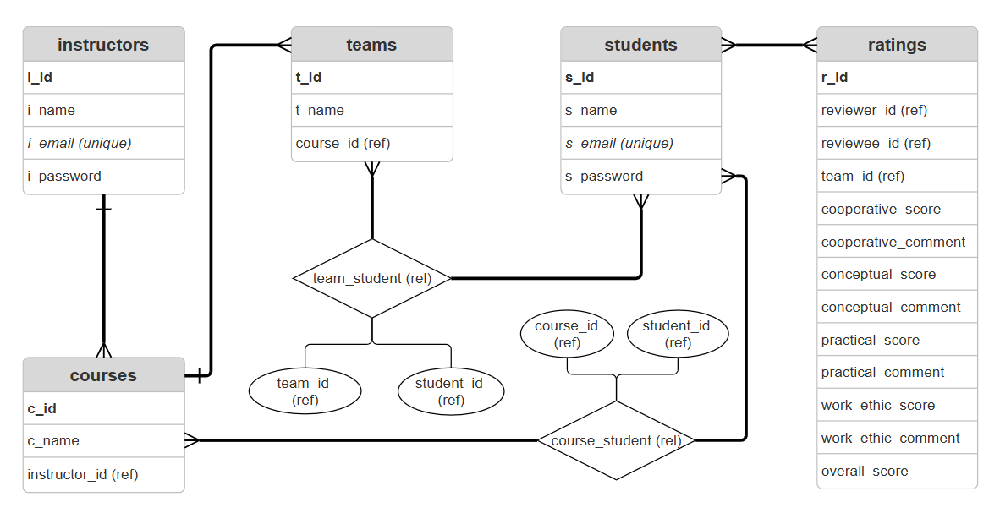

# Peer Assessment Application

## Table of contents

* [Introduction](#introduction)
* [Team members](#team-members)
* [Installation](#installation)
* [Known issues and limitations](#known-issues-and-limitations)
* [Links](#links)

## Introduction
Working in teams is often emphasized in academic settings to help students develop collaboration and co-working skills, which are essential for their future careers. However, a common issue arises when the workload is not distributed equally among team members. This imbalance can lead to a situation where one student ends up contributing significantly more than others, yet all members receive the same grade. This scenario is unfair and can cause frustration and resentment, as it rewards those who may have put in minimal effort while undervaluing the hard work and dedication of those who carried the project. Such dynamics hinder personal growth and undermine the purpose of team-based learning. This application serves as a solution to this issue. It is designed for students to evaluate their teammates in university team projects on their contribution and performance based on their cooperation, conception contribution, practical contribution and work ethic. Instructors will also be able to access the anonymous feedbacks and form teams.

### Features

- Anonymous peer assessment on a 7-point scale for each dimensions with optional additional comments
- Automated score sharing for both students and instructors
- Instructor dashboard for team creation and viewing results from peer assessments

### Database

The database consists of the following relationships:
- instructors to courses (one-to-many):  
    1 instructor teaches multiple courses
- courses to teams (one-to-many):  
    1 course contains multiple teams
- students to courses via course_student relation (many-to-many):  
    a student can be in multiple course, a course can have many students
- students to teams via team_student (many-to-many):  
    a student can join many teams (different courses), a team can have many students
- students to ratings (many-to-many):  
    a student can leave many ratings, a rating is formed from 2 students

## Team members
Name/ GitHub Username > roles 

- Bulat Abdullin / bulabd > Back-end
- Jeremie Guerchon / airicodes > Front-end
- Tymofiy Kovalenko / KapJ1coH > Back-end
- Jidapa Laopikanon / jdplao > Documentation, front-end
- Evan Teboul / M-a-a-d-man > Front-end
- Mathieu Pare Vargas / 20Mathieu03 > Front-end 

## Installation

<!--  Add any technical requirements needed for the project -->
- Clone the repository
- Open the project in your editor
- Install required dependencies by running `npm install` in your terminal from the project folder.
- To launch first open the folder named _peer-assessment-app_ by running `cd peer-assessment-app` in the terminal from the root folder of the project repository
- Then launch the application on a localhost by running `npm run start` in your terminal from the _peer-assessment-app_ folder.
- Open the landing page in your browser by copying the URL: http://localhost:3000.

## Known issues and limitations

None are known at this time.

## Links

* [Excel](https://docs.google.com/spreadsheets/d/1-OOdwkd-mQhx8gZGerOM8dGRp2eyIZ9y7WHTsZLbgnE/edit?gid=559965967#gid=559965967)
* [Burndow Chart](https://docs.google.com/spreadsheets/d/1-OOdwkd-mQhx8gZGerOM8dGRp2eyIZ9y7WHTsZLbgnE/edit?gid=559965967#gid=559965967)
* [Contribution Log](https://docs.google.com/spreadsheets/d/1-OOdwkd-mQhx8gZGerOM8dGRp2eyIZ9y7WHTsZLbgnE/edit?gid=1048892060#gid=1048892060)  
* [Database Diagram](https://github.com/Soen341-FrameNotWork/Framenotwork_SOEN341_Project_F24/blob/main/images/ERD.png)
* [Meeting minutes](https://github.com/Soen341-FrameNotWork/Framenotwork_SOEN341_Project_F24/tree/main/Meeting%20Minutes)
